# 📘 Karta Guidebook
## Sehari Bersama Karta — Project Management Tool

> **Tutorial format cerita:** ikuti satu hari kerja Pak Dimas (Admin Bidang Jalan), Bu Sari (Vendor), dan Bu Ratna (PPK) — kamu akan paham 90% fitur Karta tanpa perlu hafal menu.

**🔗 Akses Production:** https://karta.aureonforge.com
**📧 Login default:** `admin@dputr.go.id` / `password` *(ganti segera setelah login pertama!)*

---

## 📚 Daftar Isi

1. [🌅 06:30 — Bangun, Cek WA Digest](#-0630--bangun-cek-wa-digest)
2. [🏢 07:45 — Sampai Kantor, Login](#-0745--sampai-kantor-login)
3. [💬 08:00 — Tanya AI Apa Saja](#-0800--tanya-ai-apa-saja)
4. [🎯 08:30 — Brief Mendadak ke Kabid](#-0830--brief-mendadak-ke-kabid)
5. [📑 09:00 — Vendor Kirim PDF Kontrak](#-0900--vendor-kirim-pdf-kontrak)
6. [📷 10:15 — Vendor di Lapangan](#-1015--vendor-di-lapangan)
7. [📊 11:00 — Cek Laporan Harian](#-1100--cek-laporan-harian)
8. [💰 13:00 — PPK Approve Termin](#-1300--ppk-approve-termin)
9. [🔍 14:30 — Investigasi Anomali](#-1430--investigasi-anomali)
10. [🗓️ 15:00 — Plan Resource via Kalender](#-1500--plan-resource-via-kalender)
11. [📋 16:00 — Filter Kanban per Bidang](#-1600--filter-kanban-per-bidang)
12. [📤 17:00 — Export Sebelum Pulang](#-1700--export-sebelum-pulang)
13. [🚪 17:15 — Logout](#-1715--logout)
14. [📌 Lampiran: Sidebar Cheat Sheet](#-lampiran-sidebar-cheat-sheet)
15. [🆘 Troubleshooting](#-troubleshooting)

---

# 🌅 06:30 — Bangun, Cek WA Digest

Alarm bunyi jam 6 pagi. Pak Dimas masih di kasur. Belum sempat duduk, HP sudah berdering — bukan telepon, tapi notifikasi WhatsApp dari **Karta Bot**:

```
📊 Ringkasan Mingguan — Periode 5–11 Mei 2026

🚦 Status Proyek (total 72)
🟢 Aman: 12 • 🟡 Waspada: 5 • 🔴 Kritis/Terlambat: 27
✅ Selesai minggu lalu: 3

⚠️ Perlu perhatian:
• Rehabilitasi Jalan Soreang — terlambat 5 hari
• Drainase Margahayu — deadline 3 hari lagi, progres 71%
• DED Jembatan Banjaran — terlambat 8 hari

💰 4 termin menunggu approval PPK
```

Pak Dimas baca sambil masih tiduran. Sudah tau prioritas hari ini sebelum mandi.

### 🛠️ Cara Setup
- Admin: isi `WA_GATEWAY_TOKEN` di **Pengaturan → Pengaturan Sistem**
- User: pastikan `no_telp` di profile sudah benar
- Cron otomatis kirim **Senin pagi 07:00**

### 💡 Manfaat
- Tau prioritas tanpa perlu buka aplikasi
- Bisa rencana mental sambil sarapan
- Tidak ada lagi excuse "saya gak tau ada deadline"

---

# 🏢 07:45 — Sampai Kantor, Login

## Login Page

Pak Dimas buka https://karta.aureonforge.com → otomatis redirect ke `/admin/login`.

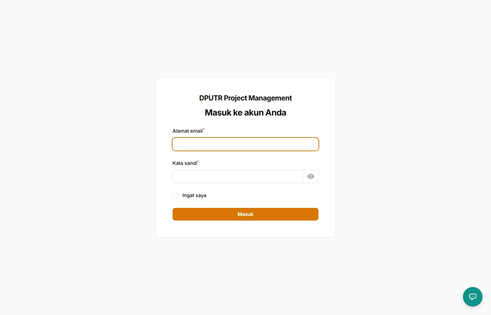

Masukkan email + password → klik Sign in.

> ⚠️ **Wajib ganti password setelah login pertama** — production live di internet, jangan biarkan default.

## Dashboard — Landing Page

Setelah login, dashboard langsung tampil dengan layout 5 area:

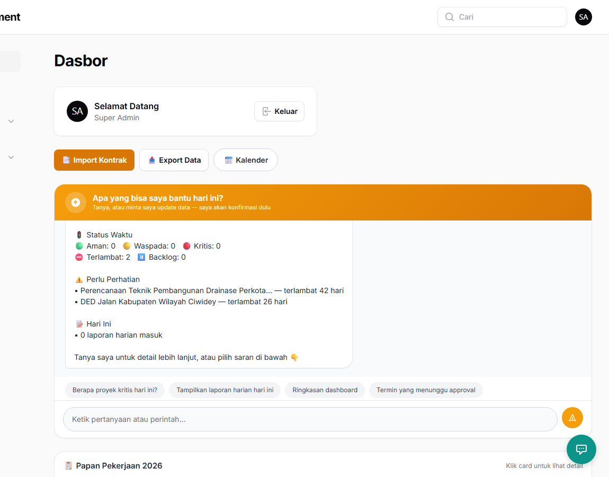

**Dari atas ke bawah:**

1. **AccountWidget** — sapaan + tombol **Keluar** (logout dari sini)
2. **3 Action Buttons** — `📑 Import Kontrak` · `📤 Export Data` · `🗓️ Kalender`
3. **AI Chat Hero** — full width, langsung ada greeting + status report otomatis
4. **Quick Suggestion Buttons** — 4 pertanyaan cepat
5. **Input Box Chat** — ketik bebas

### Status Report Otomatis (di Chat Hero)

Di dalam chat hero, ada **bubble kedua** yang otomatis muncul tiap kali buka dashboard:

```
📊 Status Hari Ini · Senin, 5 Mei 2026
──────────────────────────────

📋 Ringkasan Proyek 2026
Total: 72 • Aktif: 59 • Selesai: 13

🚦 Status Waktu
🟢 Aman: 0   🟡 Waspada: 0   🔴 Kritis: 0
⛔ Terlambat: 27   ⏸ Backlog: 32

⚠️ Perlu Perhatian
• Perencanaan Teknik Pembangunan Drainase — terlambat 41 hari
• DED Jalan Kabupaten Wilayah Ciwidey — terlambat 25 hari

📝 Hari Ini
• 0 laporan harian masuk
```

### Full Dashboard

Scroll ke bawah, masih ada widget tambahan:
- **Papan Pekerjaan Kanban** (Trello-style)
- **4 Stats** (Proyek Aktif, Total Nilai, Laporan Pending, Termin Menunggu)
- **6 Traffic Light** (distribusi status semua proyek)
- **Bar Chart** distribusi progres
- **Tabel Laporan Vendor Hari Ini**

---

# 💬 08:00 — Tanya AI Apa Saja

Pak Dimas sambil sruput kopi, ketik di chat hero:

> 👨 *"berapa proyek aktif?"*

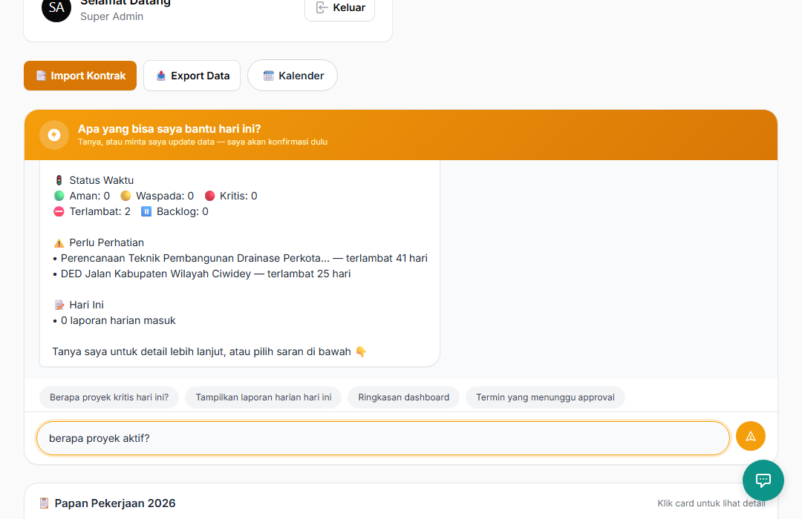

Tekan Enter — pesan kamu **langsung muncul instant** sebagai bubble amber di kanan, plus typing dots animasi:

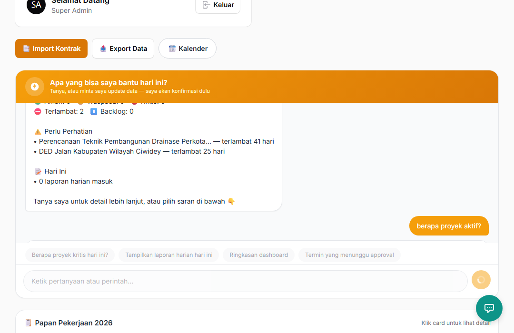

~4-8 detik kemudian, AI balas:

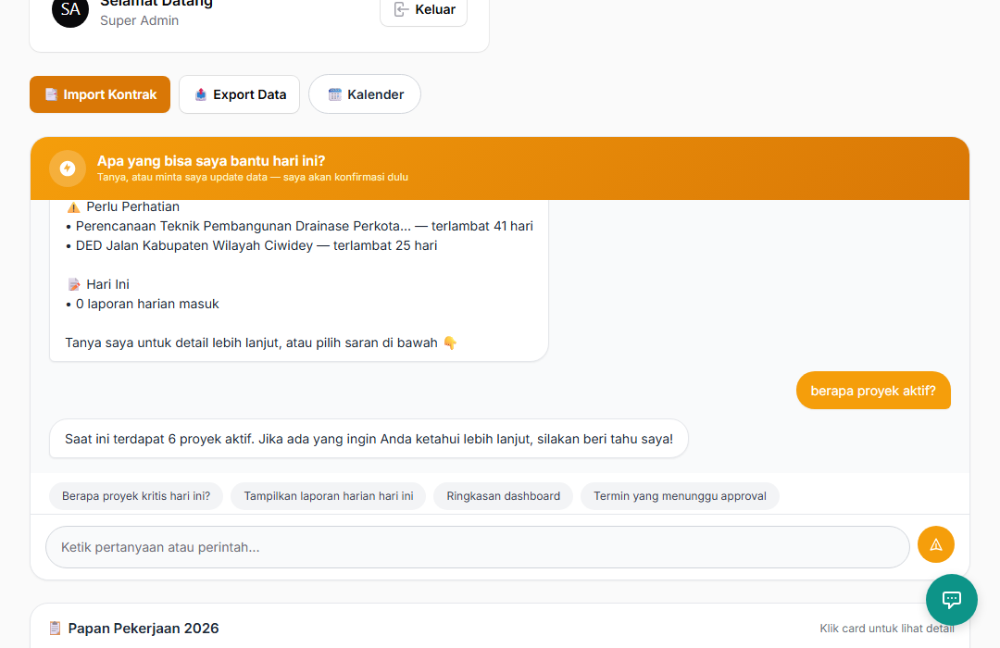

> 🤖 *"Saat ini terdapat 6 proyek aktif. Jika ada yang ingin Anda ketahui lebih lanjut, silakan beri tahu saya!"*

## 3 Tipe Perintah AI

### Tipe A: Tanya Informasi (Langsung Dijawab)

```
"berapa proyek kritis hari ini?"
"detail proyek nomor 23"
"info pekerjaan jalan soreang"
"laporan harian hari ini"
"siapa personil di proyek drainase margahayu?"
"milestone proyek nomor 18"
"termin yang masih draft"
```

### Tipe B: Minta Action (AI Konfirmasi Dulu)

```
"update progres jalan soreang jadi 75%"
"approve termin 2 drainase margahayu"
"milestone mobilisasi proyek 23 sudah selesai"
```

**Flow:**
1. Kamu ketik perintah
2. AI balas: *"Konfirmasi: ... (ya/tidak)"*
3. Ketik **"ya"** → AI eksekusi
4. AI: *"✅ Berhasil. ..."*

### Tipe C: Floating Chat di Halaman Lain

Ada juga ikon chat **teal bulat** di pojok kanan-bawah halaman manapun:


Klik → drawer chat terbuka:

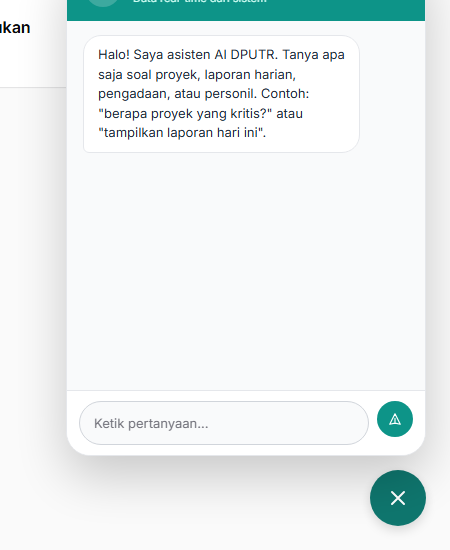

Fungsinya sama persis dengan chat hero di dashboard — bisa pakai dari halaman manapun.

---

# 🎯 08:30 — Brief Mendadak ke Kabid

Pak Dimas baru duduk, langsung ditembak Kabid:

> 👔 *"Pak Dimas, gimana proyek Drainase Margahayu? Mau di-PHO kapan?"*

Tanpa panik, sambil tetap natap muka Kabid, tangannya ngetik di chat Karta:

> 👨 *"detail termin drainase margahayu"*

5 detik kemudian:

> 🤖 *"4 termin. Termin 1 (uang muka 30%) sudah dibayar 12 Maret. Termin 2 sudah disetujui PPK, menunggu pencairan. Termin 3 (PHO) belum diajukan—syarat progres 100%. Progres saat ini 71%."*

Pak Dimas jawab Kabid dengan tenang: *"Pak, target 100% Jumat ini, jadi PHO bisa minggu depan. Termin 2 sudah disetujui Bu Ratna, tinggal nunggu Bendahara."*

Kabid manggut puas, lanjut topik lain.

> 💡 **Dulu** rapat dadakan kayak gini bikin grogi karena harus buka 3 file Excel dulu. Sekarang chat 1 baris sudah cukup.

---

# 📑 09:00 — Vendor Kirim PDF Kontrak

Email masuk dari kontraktor baru — *PT Sinar Konstruksi* — kirim PDF kontrak proyek "Pembangunan Jembatan Pasirjambu", 8 halaman penuh angka.

**Dulu** Pak Dimas akan luangkan 25 menit input manual ke Excel.

## Cara Pakai Import Kontrak

### Step 1: Klik Tombol "📑 Import Kontrak" di Dashboard

Tombol amber paling atas, di sebelah Export Data dan Kalender.

### Step 2: Modal Upload Muncul

Modal popup minta upload file PDF:
- Maksimal 10 MB
- **Wajib PDF digital** (bukan hasil scan/foto)
- Helper text: *"AI akan baca dokumen, ekstrak data, dan buka form Tambah Pekerjaan dengan field sudah terisi. Tinggal review & simpan."*

### Step 3: Klik "Proses Dokumen"

Tunggu **10-15 detik**. AI baca dokumen via OpenAI GPT-4o-mini, ekstrak field.

### Step 4: Notifikasi Sukses

> ✅ *"Dokumen berhasil dibaca. Ditemukan 4 termin pembayaran & 7 milestone — akan dibuat otomatis setelah disimpan."*

### Step 5: Auto-redirect ke Form Tambah Pekerjaan

Form sudah terisi otomatis:
- ✅ Nama pekerjaan
- ✅ No SPK + tanggal
- ✅ No SPMK + tanggal
- ✅ Nilai pagu + nilai kontrak
- ✅ Tanggal mulai + akhir
- ✅ Hari kerja + satuan waktu
- ✅ Vendor (kalau sudah ada di database, atau notif "belum ada, mau buat baru?")

### Step 6: Lengkapi yang Kosong

Yang AI **tidak bisa tebak** dan harus manual:
- **Bidang** (Bangunan Gedung / Jalan / Drainase / dll) — pilih dari dropdown
- **Status** (default: Belum Mulai) — kalau sudah jalan, ganti ke Proses Desain

> 💡 **Quick-add inline:** kalau jenis pekerjaan / perusahaan / tenaga ahli **belum ada di dropdown**, klik ikon `+` di pojok dropdown → mini modal muncul → isi nama baru → save → otomatis ter-pilih. Tidak perlu keluar form.

### Step 7: Klik Simpan

Notifikasi terakhir:
> ✅ *"Berhasil membuat 4 termin & 7 milestone dari kontrak."*

**Total waktu: ~90 detik.** Versus 25-30 menit input manual.

---

# 📷 10:15 — Vendor di Lapangan

Bu Sari (vendor PT Karya Maju) lagi ngawasin tukang cor lapis bawah di lokasi proyek Drainase Margahayu. Pekerjaan kelar jam 10 pagi, perlu lapor.

## Vendor Portal — URL Terpisah

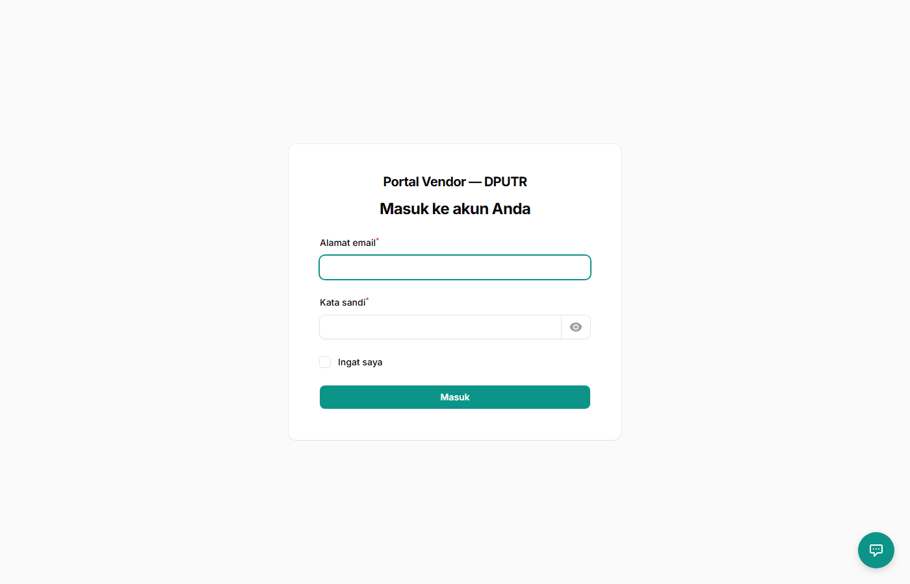

Vendor pakai **URL berbeda** dari admin:
- 🔗 https://karta.aureonforge.com/vendor

UI lebih sederhana, mobile-first, tombol besar (44px+ untuk touch screen).

### Step 1: Setup Vendor User (Sekali, oleh Admin)

1. Sidebar → **Pengaturan** ▶ → **Pengguna**
2. Tambah user baru
3. **Role:** vendor
4. **Perusahaan:** pilih dari dropdown (vendor harus link ke 1 perusahaan)
5. Save → kasih credential ke vendor

### Step 2: Vendor Login dari HP

1. Vendor buka URL `/vendor` di Chrome HP
2. Banner muncul: *"📱 Install Karta di HP kamu"* → klik **Install**
3. App ter-install di home screen, buka tanpa browser bar (PWA)
4. Login pakai credential dari admin

### Step 3: Submit Laporan Harian

Klik menu **Submit Laporan Harian:**
- 📷 **Foto** — kamera HP otomatis aktif
- 📍 **GPS** — auto-capture lokasi (kalau diizinkan browser)
- ⏰ **Waktu** — tertangkap otomatis (server time)
- **Pilih jenis:** masuk / pulang / progress
- **Catatan:** apa yang dikerjain hari ini
- Submit ✓

**Selesai dalam ~30 detik.**

> 💡 **Foto + GPS + timestamp tersimpan = audit-grade evidence.** Tidak bisa dipalsukan. Audit BPK seneng.

---

# 📊 11:00 — Cek Laporan Harian

Pak Dimas balik ke laptop. Tanya AI:

> 👨 *"laporan harian hari ini siapa aja yang udah masuk"*

> 🤖 *"Hari ini ada 5 laporan: 09:30 Drainase Margahayu (Bu Sari, foto+GPS ✓), 09:45 Jalan Soreang (Pak Adit), 10:17 Drainase Margahayu lapis bawah selesai, 10:30 DED Jembatan Ciwidey (Pak Tono), 10:50 Rehabilitasi Trotoar (Bu Lina). 3 vendor lain belum laporan: Survey Topografi, Pengadaan Aspal, Pengawasan Banjaran."*

## Lihat Laporan via Menu

Sidebar → **Laporan Harian**:

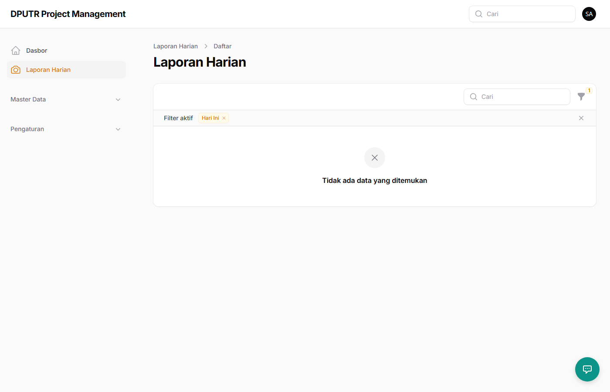

Tabel lengkap dengan: foto thumbnail, lokasi GPS, jenis (masuk/pulang/progress), vendor, catatan.

### Kirim Reminder ke Vendor yang Belum Lapor

> 👨 *"kirim reminder ke vendor yang belum laporan"*

> 🤖 *"Konfirmasi: kirim reminder WA ke 3 vendor? (ya/tidak)"*

> 👨 *"ya"*

> 🤖 *"✅ 3 reminder terkirim via WA."*

---

# 💰 13:00 — PPK Approve Termin

Bu Ratna (PPK) lagi lunch di restoran. HP-nya bunyi—WA dari Karta:

> 💰 *"Termin baru menunggu approval: Termin 2 Drainase Margahayu, Rp 600.000.000, vendor PT Karya Maju. Syarat progres minimal 60% ✅ (sekarang 71%). Login untuk review."*

## 2 Cara Approve

### Cara A: Via Chat AI (Paling Cepat)

Login dari HP, di chat:

> 👨 *"approve termin 2 drainase margahayu"*

> 🤖 *"Konfirmasi approval:*
> *• Termin 2 Drainase Margahayu*
> *• Nilai: Rp 600.000.000*
> *• Vendor: PT Karya Maju Jaya*
> *• Syarat: progres 60% (terpenuhi: 71%)*
> *Setuju? (ya/tidak)"*

> 👨 *"ya"*

> 🤖 *"✅ Termin 2 disetujui pada 5 Mei 2026. Notif terkirim ke Bendahara untuk pencairan."*

**Total: 30 detik.**

### Cara B: Via UI Manual

1. Buka detail Pekerjaan → tab **Termin Pembayaran**
2. Klik **Setujui** di baris termin status `diajukan`
3. Modal isi catatan PPK → submit
4. Status berubah `disetujui` + tanggal otomatis

## Workflow Termin Lengkap

```
Vendor (atau Admin) bikin termin
  ↓
status: draft
  ↓
Klik "Ajukan" → cek syarat progres
  ↓
status: diajukan  ← notif WA ke PPK
  ↓
PPK Setujui (chat AI atau UI)
  ↓
status: disetujui  ← notif WA ke Bendahara
  ↓
Bendahara klik "Bayar"
  ↓
status: dibayar
```

---

# 🔍 14:30 — Investigasi Anomali

Kabid kirim WA Pak Dimas: *"Pak, kenapa progres DED Jembatan Ciwidey jadi 45%? Kemarin masih 60%."*

## Audit Trail — Riwayat Semua Perubahan

Sidebar → **Pengaturan** ▶ → **Audit Trail**:


**Filter:**
- Aksi: created / updated / deleted
- User: siapa yang melakukan
- Objek: Pekerjaan / Termin / Personil / dll
- Tanggal: range filter

### Step-by-Step Investigasi

1. Filter: Objek = Pekerjaan, ID = 18, tanggal kemarin
2. Hasil muncul: *"5 Mei 13:42 — Pak Tono (PPTK) updated `progres_persen` dari 60.00 → 45.00. Catatan kosong."*

Pak Dimas WA Pak Tono → ternyata salah ketik (mau 65, ke-input 45).

### Fix via Chat

> 👨 *"update progres DED Jembatan Ciwidey jadi 65%"*

> 🤖 *"Konfirmasi update dari 45% ke 65%? (ya/tidak)"*

> 👨 *"ya"*

> 🤖 *"✅ Updated. Tercatat di Audit Trail: Pak Dimas ubah dari 45 → 65 pada 5 Mei 14:35."*

Drama selesai dalam 3 menit, **dengan jejak audit lengkap**.

> 💡 **Excel tidak punya audit trail** → kalau ada anomali, susah investigasi, sering jadi saling tuduh "kamu yang ubah!"

---

# 🗓️ 15:00 — Plan Resource via Kalender

Pak Dimas mau plan alokasi personil untuk minggu depan. Klik tombol **🗓️ Kalender** di dashboard.

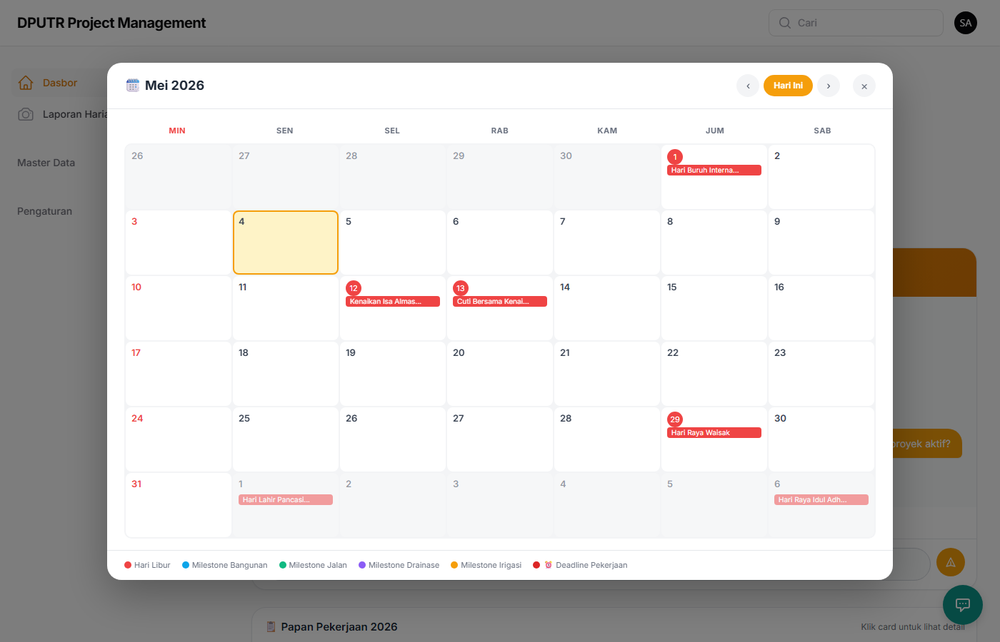

**Visualisasi:**
- 🔴 **Hari Libur** — tanggal di-circle merah dengan event chip (Hari Buruh, Cuti Bersama, Waisak, dll)
- 🎯 **Milestone Pekerjaan** — color per bidang (BG=biru, Jalan=hijau, Drainase=ungu, Irigasi=amber)
- ⏰ **Deadline Pekerjaan** — marker merah mencolok
- ⭐ **Hari Ini** — highlight kuning
- **Sunday** otomatis warna merah

## Navigasi Bulan

Tombol di pojok kanan atas:
- `‹` Bulan Sebelumnya
- `Hari Ini` → loncat ke bulan ini
- `›` Bulan Berikutnya
- `×` Tutup

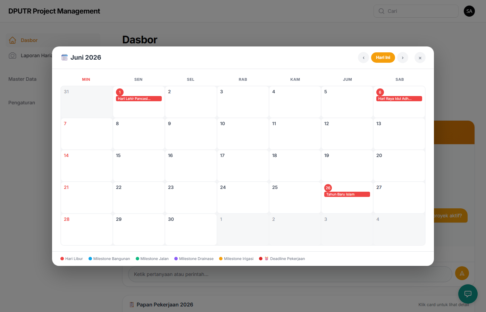

## Manfaat

- Lihat deadline padat di minggu mana
- Plan alokasi tambahan personil ke proyek deadline ketat
- Avoid scheduling launch saat libur nasional / cuti bersama

---

# 📋 16:00 — Filter Kanban per Bidang

Mau zoom ke proyek Bidang Jalan saja. Scroll ke widget **Papan Pekerjaan**:

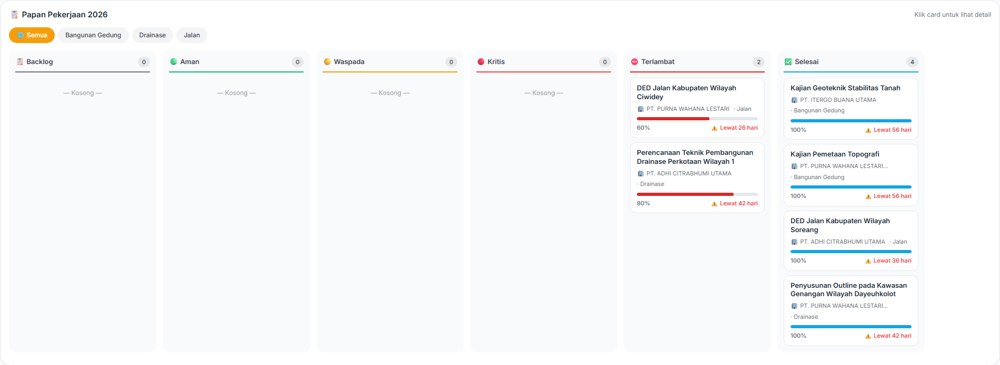

## 6 Kolom Workflow (Trello-Style)

```
📋 Backlog → 🟢 Aman → 🟡 Waspada → 🔴 Kritis → ⛔ Terlambat → ✅ Selesai
```

- **📋 Backlog** — proyek belum mulai (tanggal mulai belum tercapai)
- **🟢 Aman** — progres on-track, deadline aman
- **🟡 Waspada** — deadline mendekati (perlu perhatian)
- **🔴 Kritis** — sangat dekat deadline
- **⛔ Terlambat** — sudah lewat tanggal akhir
- **✅ Selesai** — proyek tuntas

## Filter per Bidang

Bar pill di atas kanban (5 tombol):

```
🌐 Semua | Bangunan Gedung | Drainase | Irigasi | Jalan
```

Klik **"Jalan"** → kanban refresh, hanya nampilin proyek Bidang Jalan:

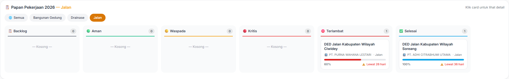

> 💡 Filter **dinamis** — cuma tampilkan bidang yang punya pekerjaan tahun ini.

## Click Card → Modal Detail

Click card mana saja → modal popup detail:

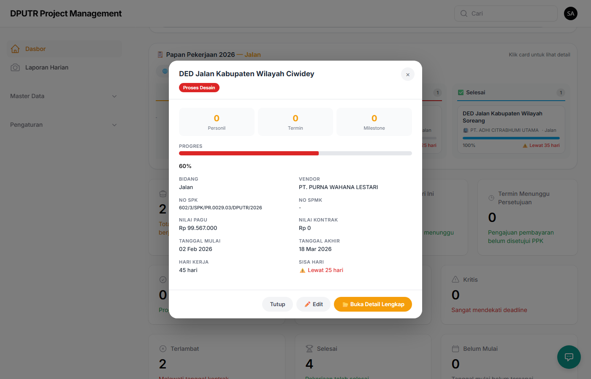

**Isi modal:**
- **Title** + status badge (warna sesuai kolom)
- **3 stat cards:** Personil · Termin · Milestone
- **Progress bar** dengan persentase
- **Field grid** 2 kolom: Bidang · Vendor · No SPK · No SPMK · Nilai Pagu · Nilai Kontrak · Tanggal Mulai · Tanggal Akhir · Hari Kerja · Sisa Hari
- **3 tombol:** `Tutup` · `✏️ Edit` · `📂 Buka Detail Lengkap`

## Buka Detail Lengkap → 7 Tab

Klik **Buka Detail Lengkap** → halaman detail Pekerjaan dengan 7 tab horizontal:

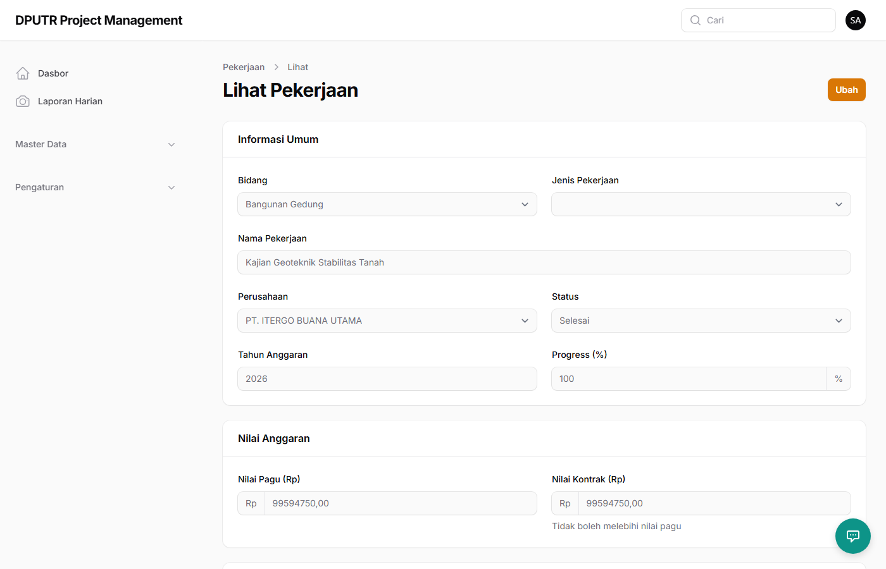

| Tab | Isinya |
|---|---|
| **Personil** | Daftar tenaga ahli yang assigned + jabatan + honor |
| **Vendor** | Perusahaan terkait (many-to-many) |
| **Rencana Pengadaan** | List barang yang akan dipakai |
| **Realisasi Pengadaan** | Barang yang sudah terealisasi |
| **Dokumen** | File kontrak, BAST, laporan |
| **Termin Pembayaran** | Termin + status approval |
| **Milestone & Jadwal** | Milestone dengan badge sumber (kontrak / AI generated) |

### Pekerjaan List (Akses Direct via URL)

Kalau perlu daftar semua proyek:

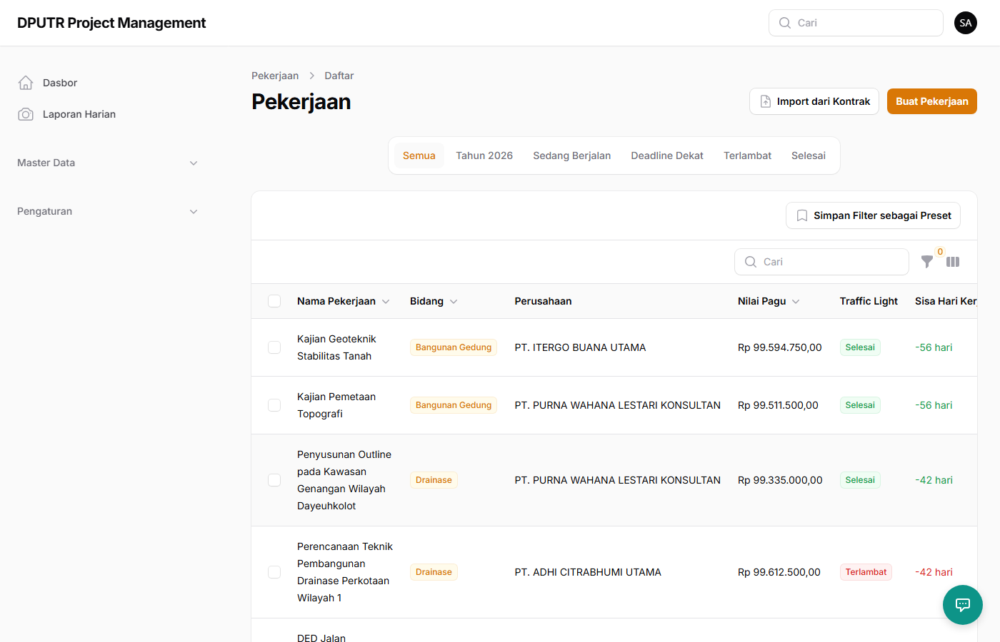

URL: `/admin/pekerjaans` (atau klik card di Kanban).

---

# 📤 17:00 — Export Sebelum Pulang

Pak Dimas mau kirim laporan mingguan ke Kabid via email.

## Klik Tombol "📤 Export Data" di Dashboard

Modal popup muncul dengan:

**Pilih Jenis Export:**
- 📊 Pekerjaan (Excel) — header biru, semua field lengkap
- 📄 Pekerjaan (PDF Landscape A4) — ringkas, siap print
- 📝 Laporan Harian (Excel) — header hijau
- 📦 Pengadaan (Excel) — header kuning
- 💰 Termin Pembayaran (Excel) — header ungu

**Pilih Tahun Anggaran** → klik **Download** → file ter-download.

Email ke Kabid: *"Pak, update mingguan terlampir."* → kirim dari mobile email.

**Selesai. Pulang jam 5:15.**

---

# 🚪 17:15 — Logout

## Cara #1: Tombol "Keluar" di AccountWidget (Paling Mudah)

Di dashboard, kotak Selamat Datang paling atas → klik tombol **Keluar**.

## Cara #2: Avatar Pojok Kanan-Atas

Klik avatar bulat **SA** di pojok kanan-atas → dropdown muncul:

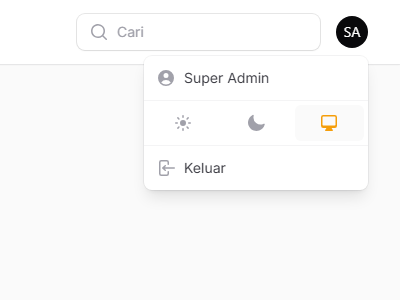

Klik **Keluar** (bahasa Indonesia, bukan "Sign out").

> 💡 **Bahasa Indonesia:** Karta full-pakai locale `id`, jadi semua label tombol/menu pakai Bahasa Indonesia.

---

# 🌙 21:00 — Karta Tetap Kerja Sendiri

Pak Dimas udah di rumah, lagi nonton bola sama anak. Karta tetap jalan otomatis di server:

```
21:00 → cron jalan
       ↓
       Kirim WA ke Bendahara:
       "1 termin baru disetujui PPK hari ini, siap pencairan:
        Termin 2 Drainase Margahayu Rp 600.000.000"
```

## Schedule Job Otomatis

| Jadwal | Notifikasi |
|---|---|
| **Senin 07:00** | Weekly digest ke admin_bidang + super_admin |
| Setiap hari 07:00 | Notif proyek deadline H-14, H-7, H-3 ke personil |
| Weekday 06:30 | Reminder vendor laporan masuk |
| Weekday 15:00 | Reminder vendor laporan pulang |
| Setiap hari 08:00 | Notif termin pending approval ke PPK |

Esok pagi, Bendahara siap kerja sebelum sampai kantor.

---

# 📊 Recap Hari Pak Dimas

| Aktivitas | Old Way (Excel) | Karta |
|---|---|---|
| Cek kondisi pagi | ❌ Tunggu rapat 9 AM | ✅ WA digest 06:30 |
| Brief ke Kabid | 15 menit nyari file | 30 detik via chat |
| Input kontrak baru | 25 menit input manual | 90 detik upload PDF |
| Cek laporan harian | Telepon 8 vendor | 1 chat command |
| Reminder vendor | 8 WA manual | 1 chat command |
| Approve termin | 3 menit per termin | 30 detik (via chat) |
| Investigasi data | Tanya tim, cek email lama | Audit Trail (10 detik) |
| Fix data salah | Edit Excel, save, kirim ulang | 1 chat command |
| Export laporan | Bikin pivot manual | 1 klik download |
| **Total waktu hemat** | — | **~3-4 jam/hari** |

---

# 📌 Lampiran: Sidebar Cheat Sheet

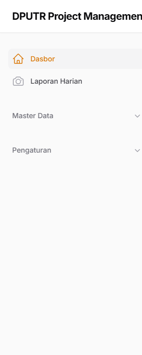

## Default View (Collapsed)

```
📊 Dasbor                 ← landing page (90% kerjaan di sini)
📝 Laporan Harian         ← lihat semua laporan vendor
📚 Master Data ▶          (klik untuk expand — collapsed default)
⚙️  Pengaturan ▶          (klik untuk expand — collapsed default)
```

## Setelah Expand

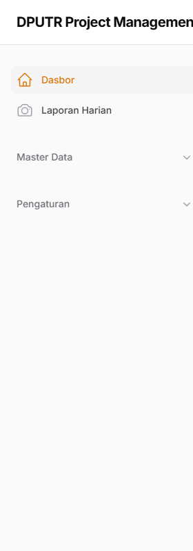

```
📊 Dasbor
📝 Laporan Harian
📚 Master Data ▼ (expanded)
   🏢 Bidang
   📦 Jenis Pekerjaan
   🏗️  Perusahaan
   🚦 Status Pekerjaan
   👷 Tenaga Ahli
   🗓️  Hari Libur
⚙️  Pengaturan ▼ (expanded)
   👥 Pengguna
   ⚙️  Pengaturan Sistem
   📜 Audit Trail
```

## Master Data Pages

### 🏢 Perusahaan


CRUD daftar vendor/kontraktor (PT, CV, Perorangan, Lainnya).

### 👷 Tenaga Ahli

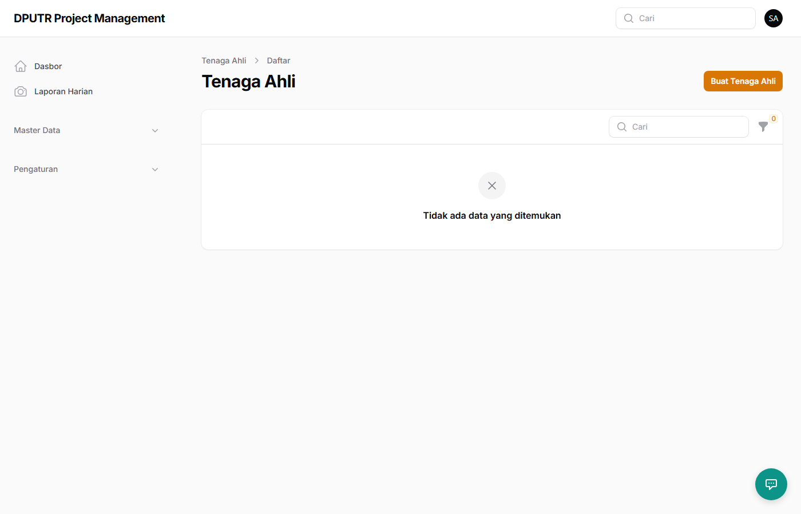

Pool personil yang bisa di-assign ke pekerjaan. Profile berisi nama, NIK, jabatan keahlian, kontak.

## Pengguna (User Management)

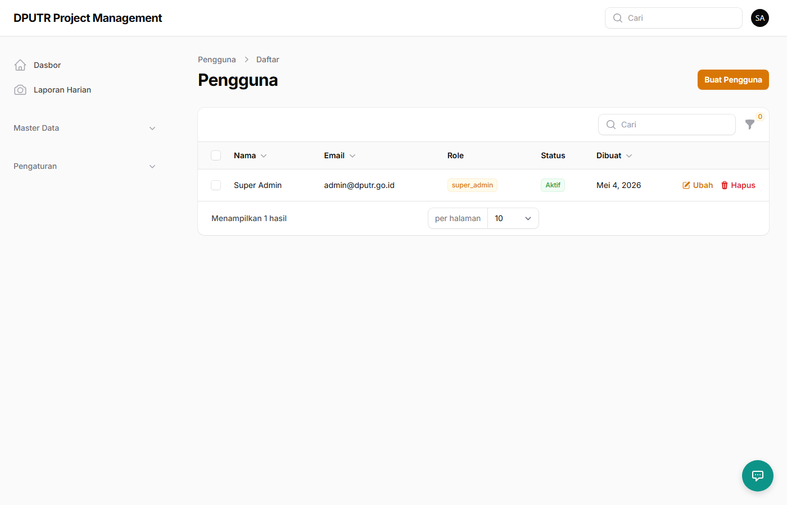

CRUD user, assign role:
- `super_admin` — akses semua
- `admin_bidang` — admin per bidang
- `pptk` — input progres, kelola personil
- `ppk` — approve termin pembayaran
- `viewer` — read-only
- `vendor` — login portal vendor

## System Settings

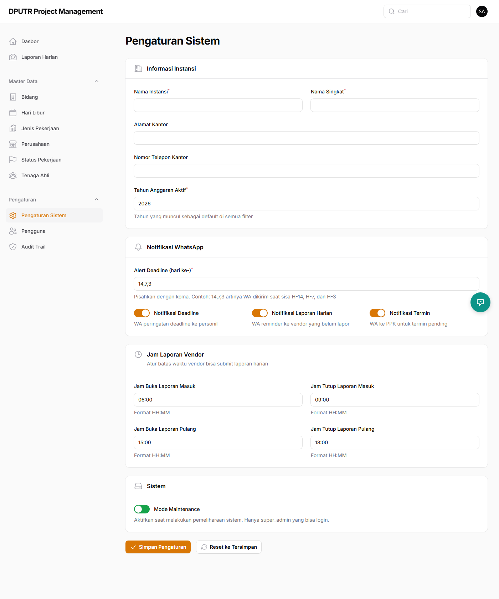

Setting global aplikasi (super_admin only):
- **Informasi Instansi** — nama, alamat, telepon
- **Tahun Anggaran Aktif**
- **Notifikasi WA** — toggle aktif/non untuk: deadline, weekly digest, reminder, termin pending
- **Jam Operasional Vendor** — buka/tutup masuk & pulang

## Halaman yang TIDAK Ada di Sidebar (Akses Lain)

Sengaja disembunyikan biar sidebar gak ramai:

| Halaman | Cara Akses |
|---|---|
| 💼 Daftar Pekerjaan | Klik card di Kanban → modal → "Buka Detail" |
| 💰 Termin Pembayaran | Detail Pekerjaan → tab "Termin Pembayaran" |
| 📁 Dokumen | Detail Pekerjaan → tab "Dokumen" |
| 📦 Rencana Pengadaan | Detail Pekerjaan → tab "Rencana Pengadaan" |
| ✅ Realisasi Pengadaan | Detail Pekerjaan → tab "Realisasi Pengadaan" |
| 🎯 Milestone | Detail Pekerjaan → tab "Milestone & Jadwal" |
| 📥 Import Data | Tombol "📑 Import Kontrak" di Dashboard |
| 📤 Export Data | Tombol "📤 Export Data" di Dashboard |

---

# 🆘 Troubleshooting

| Gejala | Solusi |
|---|---|
| Chat AI balas *"OPENAI_API_KEY belum dikonfigurasi"* | Admin: isi `OPENAI_API_KEY` di `.env`, restart server |
| Import Kontrak gagal *"tidak dapat dibaca"* | PDF hasil scan → harus PDF digital (Word export) |
| Vendor login error | Cek user role = `vendor` & link ke perusahaan |
| Notif WA gak ngirim | Cek `WA_GATEWAY_TOKEN` & `no_telp` di profile user |
| Halaman 500 error | Admin: cek `storage/logs/laravel-*.log` |
| Lupa cara | **Tanya AI** — itulah gunanya chat hero |
| Logout gak nemu | Avatar **SA** pojok kanan-atas → **Keluar** |
| Modal kalender stuck open | Tekan **ESC** atau klik `×` |
| Filter kanban gak refresh | Hard reload browser (Ctrl+Shift+R) |

---

# 💡 Filosofi Karta

> **Daripada belajar tool baru, suruh aja tool-nya kerjain.**
> Daripada input data manual, upload aja dokumen yang udah ada.
> Daripada kirim email yang gak dibuka, kirim WA yang langsung dibaca.
> Daripada vendor pakai akun guest yang clunky, kasih portal sendiri.
> Daripada ngeset semua dari nol, pilih template industri yang udah kebayang.
>
> **= Karta.**

---

# 🎓 Quick Wins untuk User Baru

## Latihan 5 Menit Pertama

Login → langsung ketik di chat hero:

1. *"berapa total proyek?"* — lihat angka real
2. *"daftar proyek aktif"* — list muncul
3. *"detail proyek nomor 1"* — detail real
4. *"milestone proyek nomor 1"* — milestone list
5. *"laporan harian hari ini"*
6. *"update progres proyek nomor 1 jadi 50%"* → ketik *"ya"*

Kalau 6 ini jalan, kamu sudah pakai 80% kekuatan Karta.

## Onboarding Admin Baru (10 Menit)

1. ✅ Login → ganti password admin (avatar → Edit Profile)
2. ✅ **Pengaturan → Pengaturan Sistem** — set nama instansi, tahun anggaran, jam operasional
3. ✅ **Master Data → Bidang** — tambah/edit sesuai kebutuhan
4. ✅ **Master Data → Perusahaan** — tambah vendor utama
5. ✅ **Pengguna** — tambah staff lain (admin_bidang, pptk, ppk, viewer)
6. ✅ Buat 1 vendor user → kasih credential ke vendor → minta mereka coba laporan harian

## Onboarding Vendor (3 Menit)

1. ✅ Buka https://karta.aureonforge.com/vendor di HP
2. ✅ Login pakai credential dari admin
3. ✅ Submit Laporan Harian pertama (foto + catatan + GPS)
4. ✅ Banner "Install di home screen" → klik **Install** (PWA)
5. ✅ Buka dari home screen tiap hari

---

**Hari kerja yang baik = pulang tepat waktu dengan semua urusan beres.**

Karta bikin itu jadi default, bukan kebetulan.

🎉 **Selamat menggunakan Karta!**

---

📞 **Bantuan lebih lanjut:**
- In-app: tanya AI Chat — *"gimana cara X?"*
- Dokumentasi: [USER_GUIDE.md](./USER_GUIDE.md)
- Setup teknis: [DEPLOY.md](../DEPLOY.md)
- Roadmap masa depan: [KARSA_DEVELOPMENT_PLAN.md](./KARSA_DEVELOPMENT_PLAN.md)
